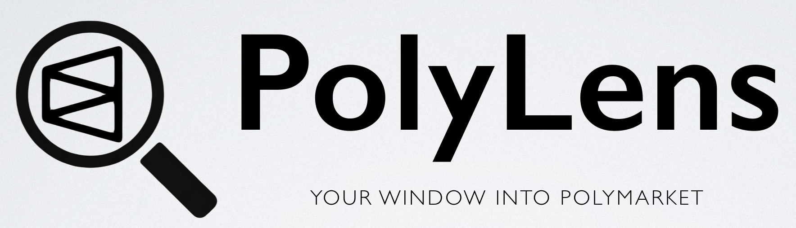
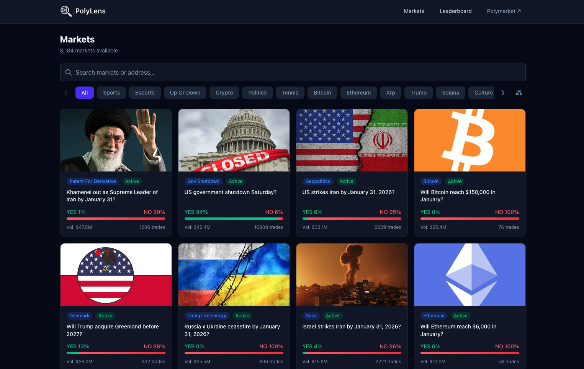
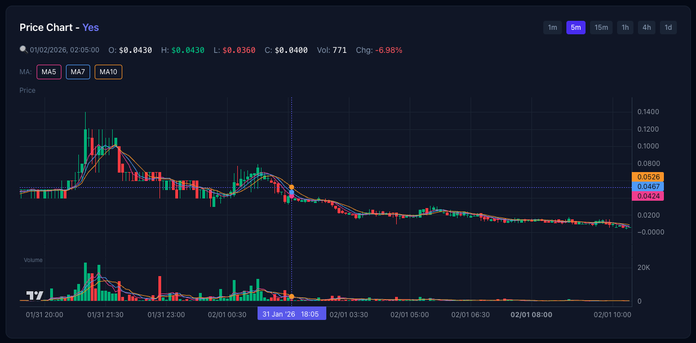
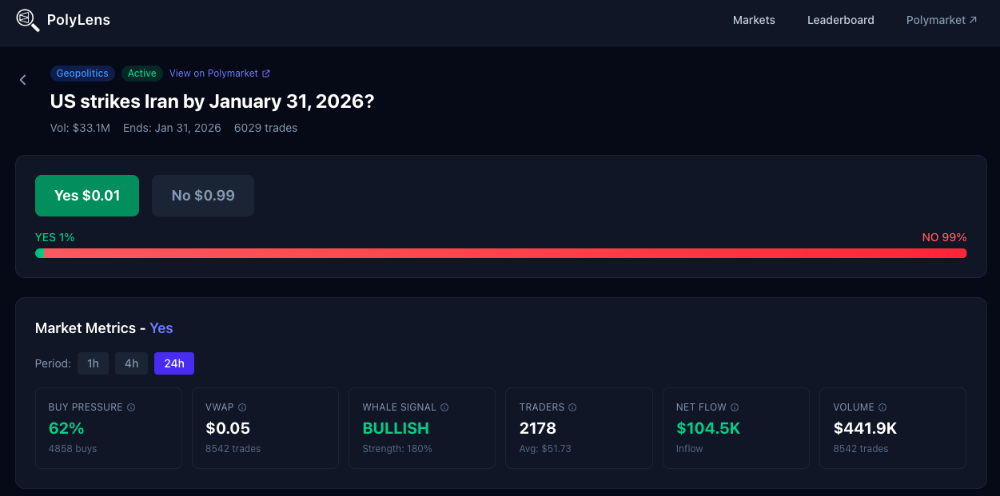
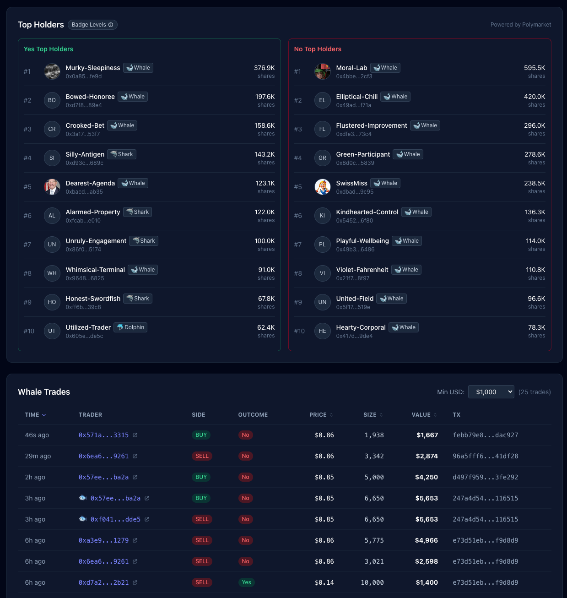
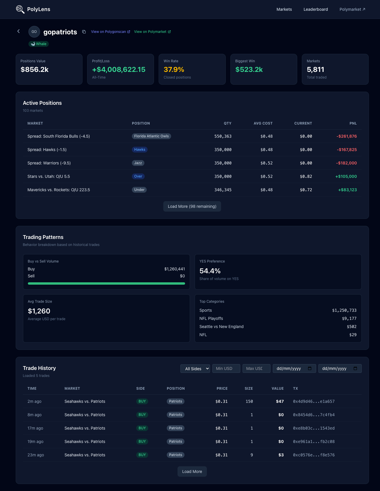
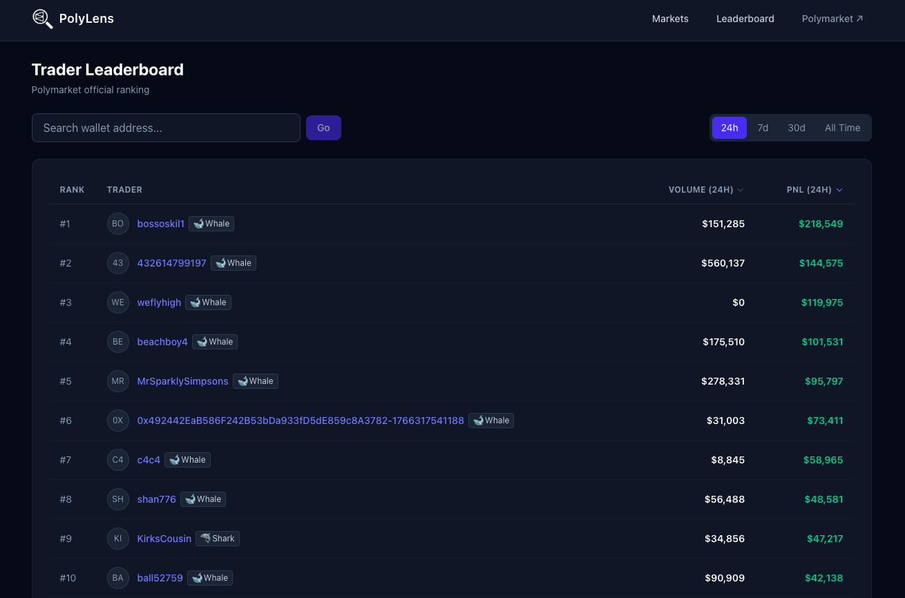
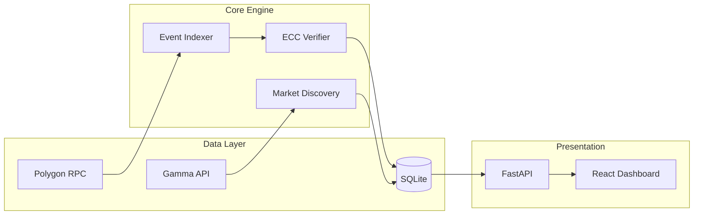

# PolyLens

<div align="center">
  
  <p>
    将原始链上透明度转化为可操作的交易情报<br/>
    发现 Alpha · 追踪鲸鱼 · 验证交易
  </p>

  [](https://www.python.org/)
  [](https://react.dev/)
  [](https://fastapi.tiangolo.com/)
  [](LICENSE)
</div>

---

## 📖 项目简介 (Introduction)

**PolyLens** 致力于弥合原始链上数据与直观交易洞见之间的沟壑。

虽然 Polymarket 的交易数据在链上是完全透明的，但原始的合约日志对交易者而言极难直接利用。**PolyLens 的核心价值在于：将“透明但难读”的链上原始日志，转化为“结构化且高价值”的交易情报。**

### PolyLens 解决的核心挑战：

*   **从 晦涩日志 到 市场全景**
    *   将零散的交易事件实时清洗并聚合为专业 K 线。
    *   **整合情绪指标**：统一计算 VWAP（成交量加权平均价）、买卖压力与资金净流入，拒绝盲人摸象，一屏掌握市场脉搏。

*   **从 海量噪音 到 鲸鱼雷达**
    *   穿透链上杂讯，精准过滤并自动标记大额资金流向。
    *   **实时异动感知**：通过 WebSocket 实时推送鲸鱼交易信号，让普通交易者也能在第一时间捕捉主力筹码分布。

*   **从 碎片地址 到 深度画像**
    *   打破数据孤岛，聚合多源 API 补齐 PnL 历史、胜率、活跃度与类别偏好。
    *   **交易员全像**：不仅看“谁在买”，更看“他的战绩如何”，为跟单交易提供强有力的数据支撑。

*   **从 链上透明 到 金融可信**
    *   内置 **ECC 密码学验证** 模块，在本地完整复现链上 Token ID 计算逻辑，确保每一条解码数据的真实性与完整性，构建金融级可信数据源。

---

## 🖥️ 核心功能展示 (Core Functional Showcase)

> *实时的市场洞察，尽在掌握*

### 1. 全局市场雷达 (Market Radar)
全网热门市场一览无余。实时监控各分类市场的流动性、交易量，快速锁定高热度交易机会。

<div align="center">
  
</div>

### 2. 专业级 K 线分析 (Pro Charts)
告别盲猜。基于链上原始成交数据聚合生成的 OHLCV 图表，支持多时间周期切换，精准揭示价格支撑与阻力位。

<div align="center">
  
</div>

### 3. 市场指标追踪 (Market Metrics)
深度透视市场情绪。集成 VWAP（成交量加权平均价）、买卖压力比、净流入资金及交易者活跃度，全方位量化市场动向。

<div align="center">
  
</div>

### 4. 鲸鱼实时追踪 (Whale Tracking)
主力资金无处遁形。基于链上数据实时监控大额异动，利用 WebSocket 高频推送买卖方向。告别滞后指标，直接跟随“聪明钱”的筹码流向。

<div align="center">
  
</div>

### 5. 交易员深度画像 (Trader Profiling)
知己知彼。透视特定地址的历史盈亏曲线、胜率分布及持仓风格，通过数据分析识别真正的高手。

<div align="center">
  
</div>

### 6. 排行榜与信号发现 (Leaderboard)
寻找全网最强交易员。按盈亏（PnL）或交易量实时排名，一键探索顶级玩家的交易策略与最新调仓动态。

<div align="center">
  
</div>

---

## 🚀 快速开始 (Quick Start)

### 第一步：环境准备
```bash
cd <项目存储路径>/submission
```

### 第二步：配置环境变量
```bash
cp .env.example .env
# 编辑 .env 文件，填入 API 等信息
```

### 第三步：安装依赖
```bash
pip install -r requirements.txt
```

### 第四步：索引数据（首次运行需要）
```bash
# 若不提供选项参数，默认索引最近 200 个区块：
python -m src.main index --latest 1000
```

### 第五步：启动后端 API 服务
```bash
python -m src.api.server --db ./data/demo_indexer.db --port 8000
```
服务将在 http://localhost:8000 启动。

### 第六步：启动前端（新开一个终端窗口）
```bash
cd web
npm install
npm run dev
```
前端将在 http://localhost:5173 启动。

### 验证运行状态
*   **后端 API**: 访问 http://localhost:8000/docs 查看 Swagger 文档
*   **前端界面**: 访问 http://localhost:5173 查看仪表盘

---

## 🛠️ 技术架构 (Architecture)



## 🤝 贡献与致谢

*   **开发者**: [Leon/zh0006xu](https://github.com/zh0006xu)
*   **特别感谢**: [OGBC Team](https://github.com/ogalias/OGBC-Intern-Project) 提供的资源

---

<div align="center">
  <sub>Built with ❤️ for the decentralized future.</sub>
</div>